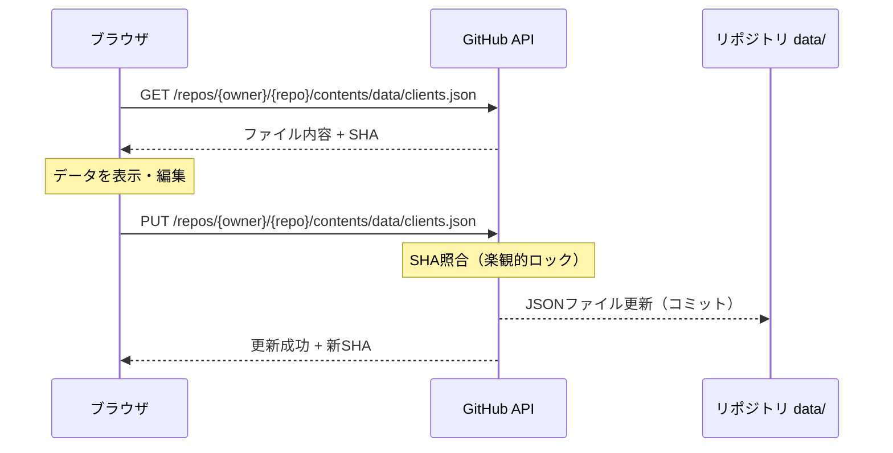
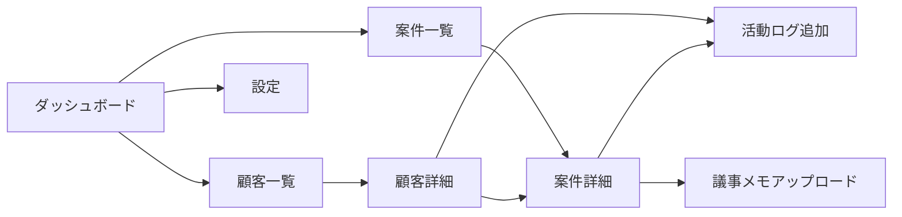
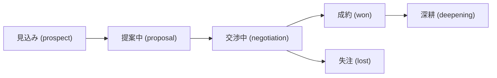

# コンサル案件クライアント管理システム MVP

コンサルティング案件を顧客別に管理するWebアプリケーションのMVPを構築します。GitHub Pages上にデプロイし、社内5名程度で試用する想定です。

## User Review Required

> [!IMPORTANT]
> **GitHub API によるデータ共有**: リポジトリ内の `data/` フォルダにJSONファイルとしてデータを保存し、GitHub REST API で読み書きします。
> - ユーザーは初回アクセス時に **GitHub Personal Access Token** を設定する必要があります（設定画面を用意）
> - トークンはブラウザの localStorage に保存（データ本体はGitHub上のJSONファイル）
> - 5名程度の利用であれば API レート制限（5,000回/時）は問題ありません
> - **同時編集時の競合**: SHA ベースの楽観的ロックで検知し、リトライする仕組みを実装します

> [!NOTE]
> **議事メモ**: メモ帳で作成したテキストファイル（.txt）をドラッグ&ドロップでアップロード可能。テキスト内容をJSONに保存します。

## 技術スタック

| 項目 | 選定 |
|------|------|
| フレームワーク | React 18 + TypeScript |
| ビルドツール | Vite |
| ルーティング | React Router v6 |
| 状態管理 | React Context + useReducer |
| データ永続化 | **GitHub API → リポジトリ内JSONファイル** |
| スタイリング | Vanilla CSS (CSS Variables) |
| デプロイ | GitHub Pages (gh-pages) |

## データモデル

```typescript
// 顧客
interface Client {
  id: string;
  companyName: string;     // 会社名
  contactPerson: string;   // 担当者名
  email: string;
  phone: string;
  address: string;
  notes: string;
  createdAt: string;
  updatedAt: string;
}

// 案件ステータス
type ProjectStatus = 'prospect' | 'proposal' | 'negotiation' | 'won' | 'lost' | 'deepening';

// 案件
interface Project {
  id: string;
  clientId: string;
  title: string;
  description: string;
  status: ProjectStatus;
  amount: number;          // 見込み金額
  startDate: string;
  endDate: string;
  createdAt: string;
  updatedAt: string;
}

// 活動ログ（アポイント・会話記録）
interface Activity {
  id: string;
  projectId: string;
  clientId: string;
  type: 'appointment' | 'call' | 'email' | 'meeting' | 'other';
  title: string;
  description: string;
  date: string;
  createdAt: string;
}

// 議事メモ
interface MeetingNote {
  id: string;
  projectId: string;
  clientId: string;
  activityId?: string;
  fileName: string;
  content: string;         // テキスト内容
  uploadedAt: string;
}
```

## データ保存の仕組み



**リポジトリ内のデータ構成:**
```
data/
├── clients.json       # 顧客マスタ
├── projects.json      # 案件一覧
├── activities.json    # 活動ログ
└── meeting-notes.json # 議事メモ
```

## Proposed Changes

### プロジェクト初期化

#### [NEW] Vite + React + TypeScript プロジェクト
- `npx create-vite` で初期化
- React Router, uuid 等の依存パッケージをインストール

---

### デザインシステム

#### [NEW] [index.css](file:///c:/Dev_vibe/antigravity/E2E-client-management/src/index.css)
- CSS Variables によるカラーパレット（ダークモード調のプロフェッショナルテーマ）
- タイポグラフィ（Google Fonts: Inter）

---

### データ層

#### [NEW] [types.ts](file:///c:/Dev_vibe/antigravity/E2E-client-management/src/types.ts)
- 全データモデルの型定義

#### [NEW] [github.ts](file:///c:/Dev_vibe/antigravity/E2E-client-management/src/utils/github.ts)
- GitHub REST API クライアント
- JSONファイルの読み込み（GET + Base64デコード）
- JSONファイルの書き込み（PUT + SHAベース競合検知）
- トークン管理

#### [NEW] [storage.ts](file:///c:/Dev_vibe/antigravity/E2E-client-management/src/utils/storage.ts)
- GitHub API を利用した CRUD ユーティリティ
- サンプルデータのシード機能

#### [NEW] [AppContext.tsx](file:///c:/Dev_vibe/antigravity/E2E-client-management/src/context/AppContext.tsx)
- React Context + useReducer による状態管理
- GitHub API と連携したデータ同期

---

### 共通コンポーネント

#### [NEW] [Layout.tsx](file:///c:/Dev_vibe/antigravity/E2E-client-management/src/components/Layout.tsx)
- サイドバーナビゲーション＋メインコンテンツ領域

#### [NEW] [StatusBadge.tsx](file:///c:/Dev_vibe/antigravity/E2E-client-management/src/components/StatusBadge.tsx)
- 案件ステータス表示用バッジ

#### [NEW] [Modal.tsx](file:///c:/Dev_vibe/antigravity/E2E-client-management/src/components/Modal.tsx)
- 汎用モーダルダイアログ

#### [NEW] [FileDropZone.tsx](file:///c:/Dev_vibe/antigravity/E2E-client-management/src/components/FileDropZone.tsx)
- ドラッグ&ドロップ対応のテキストファイルアップロードエリア

---

### ページ

#### [NEW] [Dashboard.tsx](file:///c:/Dev_vibe/antigravity/E2E-client-management/src/pages/Dashboard.tsx)
- 案件ステータス別サマリーカード、直近の活動ログ

#### [NEW] [ClientList.tsx](file:///c:/Dev_vibe/antigravity/E2E-client-management/src/pages/ClientList.tsx)
- 顧客一覧（検索・フィルタ付き）、顧客追加フォーム

#### [NEW] [ClientDetail.tsx](file:///c:/Dev_vibe/antigravity/E2E-client-management/src/pages/ClientDetail.tsx)
- 顧客詳細、関連案件、活動履歴タイムライン、議事メモ

#### [NEW] [ProjectList.tsx](file:///c:/Dev_vibe/antigravity/E2E-client-management/src/pages/ProjectList.tsx)
- 案件一覧（ステータスフィルタ）、カンバンビュー

#### [NEW] [ProjectDetail.tsx](file:///c:/Dev_vibe/antigravity/E2E-client-management/src/pages/ProjectDetail.tsx)
- 案件詳細・編集、ステータス変更、活動ログ・議事メモ管理

#### [NEW] [Settings.tsx](file:///c:/Dev_vibe/antigravity/E2E-client-management/src/pages/Settings.tsx)
- GitHub Token 設定画面、リポジトリ設定、接続テスト

---

### デプロイ

#### [NEW] [vite.config.ts](file:///c:/Dev_vibe/antigravity/E2E-client-management/vite.config.ts)
- GitHub Pages 用の `base` パス設定

#### [NEW] [deploy.yml](file:///c:/Dev_vibe/antigravity/E2E-client-management/.github/workflows/deploy.yml)
- GitHub Actions による自動デプロイワークフロー

---

## 画面遷移



## ステータスフロー



## Verification Plan

### ブラウザテスト
1. `npm run dev` でローカルサーバーを起動
2. 以下を確認:
   - GitHub Token 設定・接続テスト
   - 顧客の追加・編集・一覧表示
   - 案件の追加・ステータス変更
   - 活動ログの追加・タイムライン表示
   - テキストファイルのドラッグ&ドロップアップロード

### ビルド確認
- `npm run build` が正常完了すること

## フェーズ2 への展望（参考）
- 認証機能（GitHub OAuth）
- 大容量ファイルストレージ
- メール通知・リマインダー機能
- レポート・分析機能
- ステータスのカスタマイズ機能
